# Translation Dashboard Coordinator Tools (TDC)

The Translation Dashboard Coordinator Tools (TDC) is a web-based platform designed to assist coordinators in managing and facilitating translation efforts within the WikiProject Medicine community. It provides tools for tracking translations, managing users, and ensuring the smooth execution of translation projects.

## Features

TDC includes a variety of tools categorized into different sections:

### **Translations**
- **Recent**: View the most recently translated pages.
- **Recent in User Space**: Track recent translations within user spaces.
- **In Process**: Monitor ongoing translations.
- **In Process (Total)**: View all translations currently in progress.
- **Publish Reports**: Access reports on published translations.

### **Pages**
- **Translate Type**: Manage translation types.
- **Translated Pages**: List and manage translated pages.
- **Add**: Add new pages for translation.

### **Qids**
- **Qids**: Manage Wikidata QIDs for translated pages.
- **Qids Others**: Handle additional QID-related data.

### **Users**
- **Emails**: Manage user email lists.
- **Projects**: Track ongoing translation projects.
- **Full Translators**: List full translators involved in the project.

### **Others**
- **Coordinators**: Manage translation coordinators.
- **Campaigns**: Oversee and organize translation campaigns.
- **Status**: View the overall status of translations.
- **Settings**: Adjust platform settings and configurations.

### **Tools**
- **Fixwikirefs (Options)**: Configure reference fixing options.
- **Fixwikirefs**: Automatically fix references in translated pages.

```mermaid
flowchart TD
    %% Presentation Layer
    subgraph "Presentation Layer"
        F1["Frontend: Dashboard & Login"] 
    end

    %% Business Logic Layer
    subgraph "Business Logic Layer"
        AL["Actions: mdwiki_sql.php - Handles wiki translation operations (SQL SELECT/WRITE)"]
        API["API/SQL Module: Endpoints (index, recent_data[SELECT], process_data[WRITE], include)"]
        AUTH["Auth Module: Manages authentication (SQL SELECT/WRITE)"]
        
        subgraph "Coordinator Admin Modules"
            CAM["Campaigns Module: Lists campaigns and updates records (SELECT/WRITE)"]
            EMA["Emails Module: Retrieves and updates email data (SELECT/WRITE)"]
            QID["QIDs Module: Manages QID assignments and updates (SELECT/WRITE)"]
            ADD["Add Module: Adds new pages with verification (SELECT/WRITE)"]
            SET["Settings Module: Reads and updates configuration (SELECT/WRITE)"]
            FT["Full Translators Module: Manages translator data (SELECT/WRITE)"]
            TR["Translated Module: Handles translation records (SELECT/WRITE)"]
            TT["TT Module: Manages translation types (SELECT/WRITE)"]
            WR["Wikirefs Options Module: Configures wikireference settings (SELECT/WRITE)"]
            TOOLS["Tools Module: Processes data and displays statistics (SELECT/WRITE)"]
        end
    end

    %% Persistence Layer
    subgraph "Persistence Layer"
        DB["Database: Translation Tables"]
    end

    %% Data flow from Frontend to Backend Modules
    F1 -->|"Request"| AUTH
    F1 -->|"Request"| AL
    F1 -->|"Request"| API
    F1 -->|"Request"| CAM
    F1 -->|"Request"| EMA
    F1 -->|"Request"| QID
    F1 -->|"Request"| ADD
    F1 -->|"Request"| SET
    F1 -->|"Request"| FT
    F1 -->|"Request"| TR
    F1 -->|"Request"| TT
    F1 -->|"Request"| WR
    F1 -->|"Request"| TOOLS

    %% Backend Modules interacting with Database
    AL -->|"SQL SELECT/WRITE"| DB
    API -->|"SQL SELECT/WRITE"| DB
    AUTH -->|"SQL SELECT/WRITE"| DB
    CAM -->|"SQL SELECT/WRITE"| DB
    EMA -->|"SQL SELECT/WRITE"| DB
    QID -->|"SQL SELECT/WRITE"| DB
    ADD -->|"SQL SELECT/WRITE"| DB
    SET -->|"SQL SELECT/WRITE"| DB
    FT -->|"SQL SELECT/WRITE"| DB
    TR -->|"SQL SELECT/WRITE"| DB
    TT -->|"SQL SELECT/WRITE"| DB
    WR -->|"SQL SELECT/WRITE"| DB
    TOOLS -->|"SQL SELECT/WRITE"| DB

    %% Click Events for Component Mapping
    click DB "https://github.com/mdwiki-td/tdc/blob/main/Tables/tables.php"
    click AL "https://github.com/mdwiki-td/tdc/blob/main/actions/mdwiki_sql.php"
    click API "https://github.com/mdwiki-td/tdc/blob/main/api_or_sql/index.php"
    click AUTH "https://github.com/mdwiki-td/tdc/blob/main/auth/index.php"
    click CAM "https://github.com/mdwiki-td/tdc/blob/main/coordinator/admin/Campaigns/index.php"
    click EMA "https://github.com/mdwiki-td/tdc/blob/main/coordinator/admin/Emails/index.php"
    click QID "https://github.com/mdwiki-td/tdc/blob/main/coordinator/admin/qids/index.php"
    click ADD "https://github.com/mdwiki-td/tdc/blob/main/coordinator/admin/add/index.php"
    click SET "https://github.com/mdwiki-td/tdc/blob/main/coordinator/admin/settings/index.php"
    click FT "https://github.com/mdwiki-td/tdc/blob/main/coordinator/admin/full_translators/index.php"
    click TR "https://github.com/mdwiki-td/tdc/blob/main/coordinator/admin/translated/index.php"
    click TT "https://github.com/mdwiki-td/tdc/blob/main/coordinator/admin/tt/index.php"
    click WR "https://github.com/mdwiki-td/tdc/blob/main/coordinator/admin/wikirefs_options/index.php"
    click TOOLS "https://github.com/mdwiki-td/tdc/blob/main/coordinator/tools/index.php"

    %% Styles
    classDef frontend fill:#f9d6d5,stroke:#d45b5b,stroke-width:2px,color:#000;
    classDef backend fill:#d5e8d4,stroke:#82b366,stroke-width:2px,color:#000;
    classDef coordinator fill:#d0e0e3,stroke:#4a777a,stroke-width:2px,color:#000;
    classDef database fill:#fce5cd,stroke:#e69138,stroke-width:2px,color:#000;

    class F1 frontend;
    class AL,API,AUTH backend;
    class CAM,EMA,QID,ADD,SET,FT,TR,TT,WR,TOOLS coordinator;
    class DB database;
```

